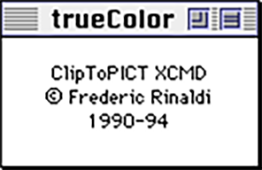

# trueColor

All cards of the trueColor stack, magnified by a factor of two.
They were presented in the slideshow when opening the stack.

Note that visual appearance was already somewhat broken when
I took those screenshots (apparently in 2005),
because Apple had made changes to their fonts,
here in particular Times.
Some text is in a 7 pt Geneva font I made.

See also its [readme](../trueColor.pdf)
and [selected HyperTalk scripts](../HyperTalk/trueColor.md) from it.

