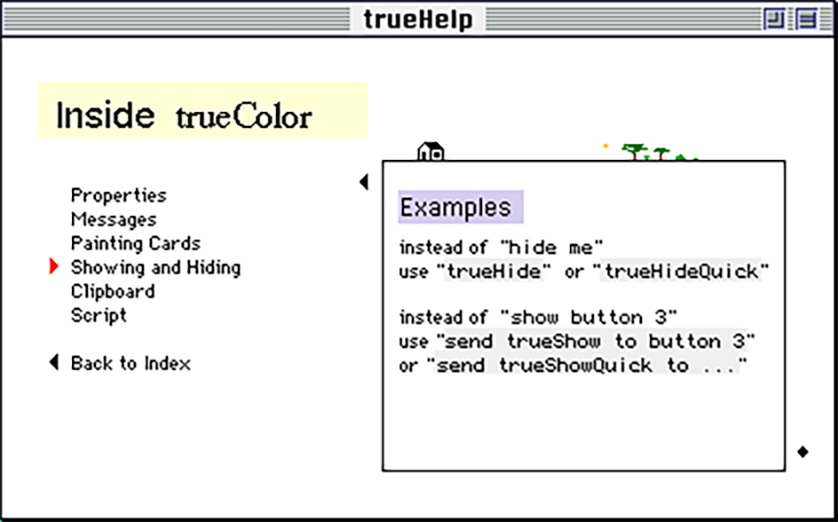

# trueHelp

All cards of the stack (magnified by a factor of two),
in their order.

Personally, I love this stack…

Note that visual appearance was already somewhat broken when
I took those screenshots (apparently in 2005),
because Apple had made changes to their fonts.

Note also that the text field on the last card on the left
uses a 7 pt Geneva font I made.

