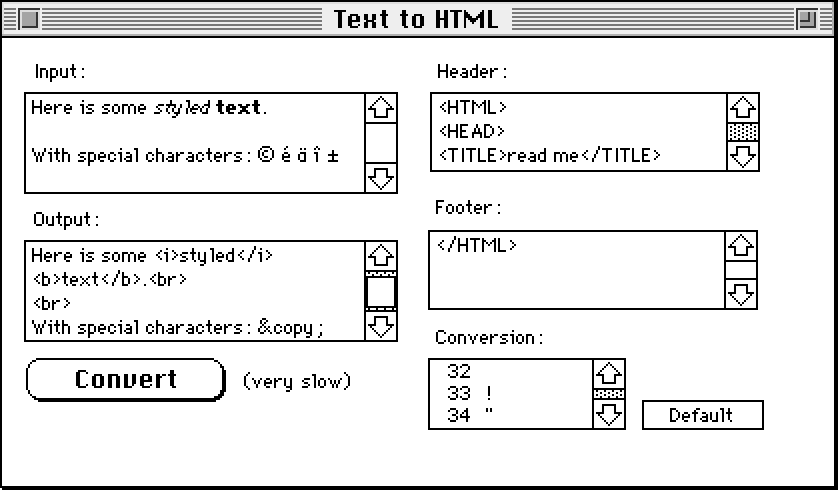

# trueTools

All trueTool stacks (which were all one-carders)
(magnified by a factor of two)
in alphabetical order,
hence my favorite stack "vue" at the end.

Note that visual appearance was already somewhat broken when
I took those screenshots in 2024,
because Apple had made changes to their fonts
and due to restrictions of the emulator.

## JPEGtoPICT

This stack allowed to convert JPEG images (and I think also GIFs)
to the PICT format that was used widely on Macs at the time,
using Apple's Quicktime via AppleScript.

See also its [readme](../READMEs/trueTools-JPEGtoPICT.pdf).

## spider

This stack turned HyperCard stack cards into webpages
with one image screenshot stack card.

See also its [readme](../READMEs/trueTools-spider.pdf).

## Text to HTML

This stack simply converted given text to HTML,
i.e. it replaced some characters by their HTML escapes
(like "&amp;" for "&") plus detected bold and italic text.

## trueConvert

This stack converted stacks colorized with trueColor
to ones colorized with Apple's Color Tools (AddColor XCMD),
at the time still hoping for a HyperCard 3.0 sometime
with native color support
which would have likely only supported color
added  via Apple's Color Tools.

See also its [readme](../READMEs/trueTools-trueConvert.pdf).

## truePrint

This stack took screenshots of cards of HyperCard stacks
to the clipboard and also allowed to print them.

See also its [readme](../READMEs/trueTools-truePrint.pdf).

## vue

This is my favorite stack in the "trueTools" collection.
It allowed to view images full screen without distractions,
with possibility to zoom in and out, and to move around.

See also its [readme](../READMEs/trueTools-vue.pdf).

