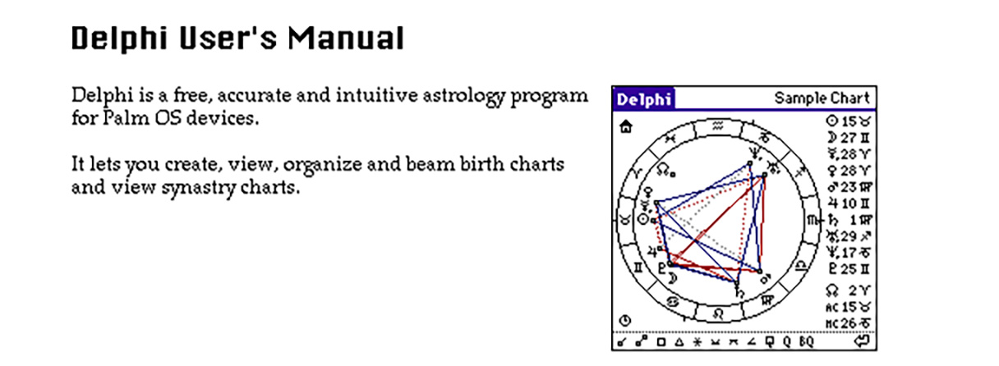
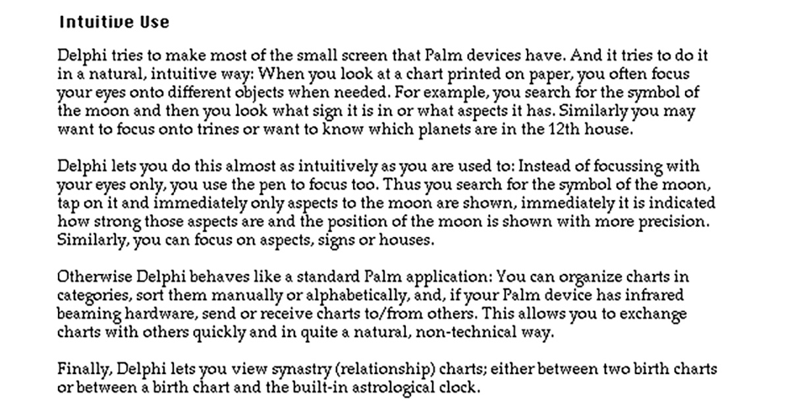

The user manual webpage for Delphi 2.01 in 2002
(images blown up by a factor two, no working links on the images).

Most likely I designed this webpage in HyperCard
and then used some of my HyperCard trueTools stacks.

