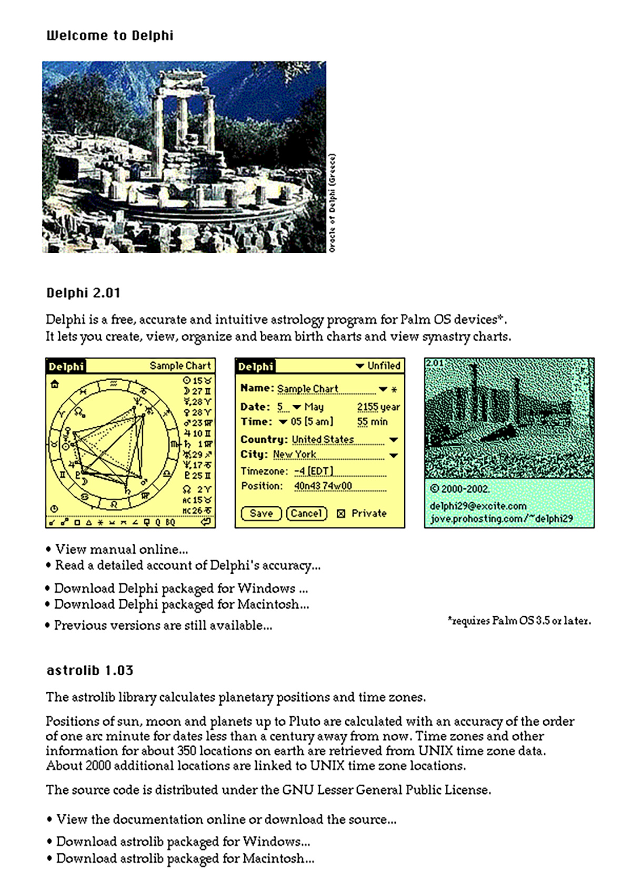

The home page for Delphi 2.01 and astrolib 1.03 in 2002
(images blown up by a factor two, no working links on the images).

Most likely I designed this page in a HyperCard stack and then took screenshots
using one my HyperCard trueTools stacks, namely the truePrint stack.

