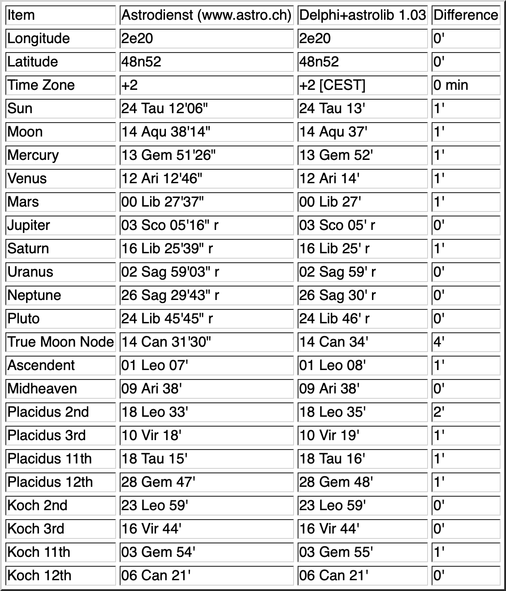
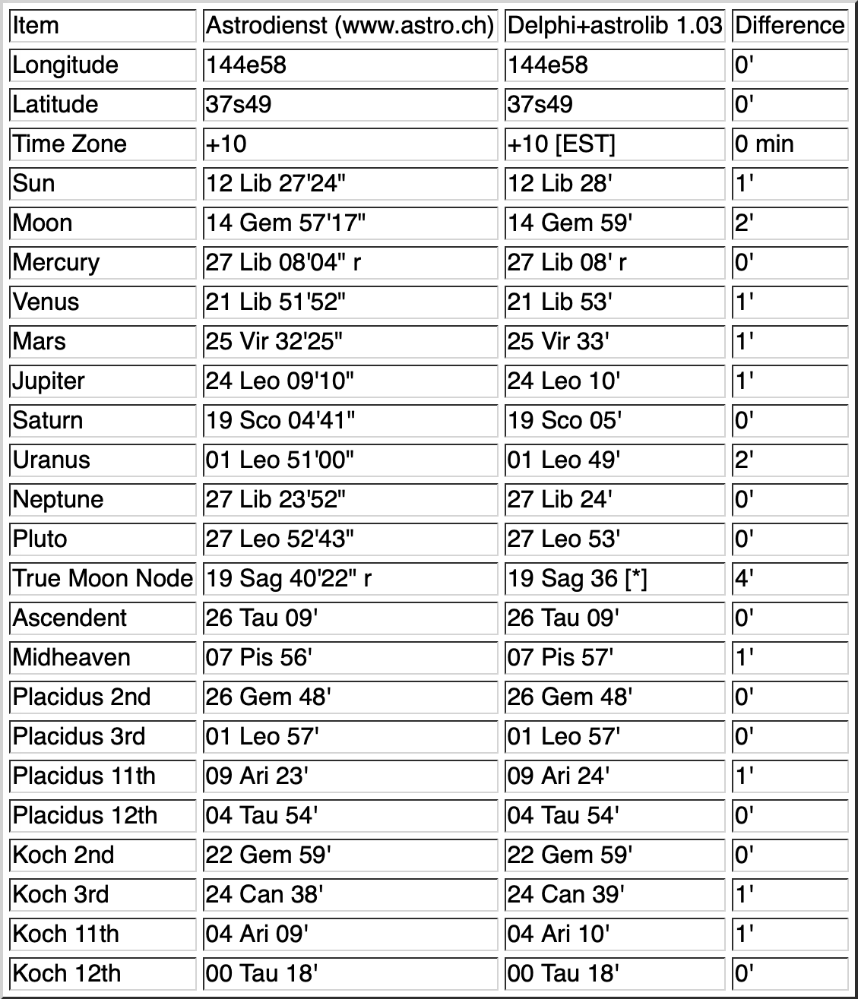
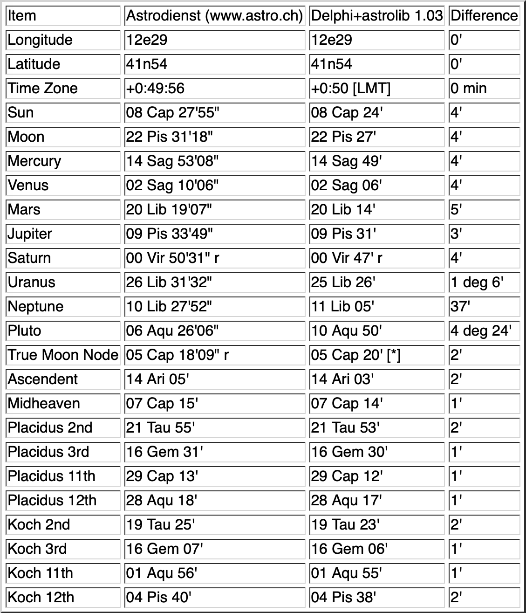

Web page about the accuracy of Delphi resp. astrolib in 2000,
rendered to Markdown (and HTML tables to images).

# Accuracy of Delphi 1.20 / astrolib 1.03

This document aims to give a detailed account
of the accuracy of Delphi.
Three charts have been calculated using Delphi 1.20
in combination with astrolib 1.03.
The reference data has been obtained from the free chart service
of Astrodienst (www.astro.ch),
whose calculations are based on JPL (NASA) data.

Chart 1: Paris 1982\
Chart 2: Melbourne 1955\
Chart 3: Rome 800

## General Comments

Planetary positions are calculated with an accuracy
of the order of one arc minute for dates
less than a century away from now.

The position of Pluto is calculated from a numerical fit
to its orbit, which seems to be optimized for the 20th century.
Outside this range, precision deteriorates more quickly
than for the other objects.

The position of the true moon node is of the order of 5 times
less precise than the position of the moon.
The largest error I have seen in the 20th century was 10'.

Time zones are calculated from UNIX time zone data,
which ranges back to dates when countries observed local mean time.
There are about 350 UNIX time zone locations,
plus about 2000 additional locations
(recognizable by the dimmed clock symbol in Delphi)
of which each one has been assigned
to one of the UNIX time zone locations.
The data for the additional locations has been collected as follows.

For US locations,
latitiude and longitude have been electronically extracted
from the US 1990 Census data and time zones have been determined
from the 1995 Rand McNally Road Atlas
in combination with UNIX location comments.
For non-US locations,
latitude and longitude have been entered manually from paper sources,
then plotted and verified visually in order to exclude any gross errors.
Time zones have been determined from various maps in combination
with UNIX location comments.

Please refer to astrolib's documentation and source code
for further information.

## Chart 1

Paris (France), 15 May 1982, 10.55 am local time

## Chart 2

Melbourne (Australia), 6 October 1955, 10.01 pm local time

## Chart 3

Rome (Italy), 25 December 800, noon local time (Julian Calendar)

[*] Delphi does not calculate whether the true moon node is retrograde.
