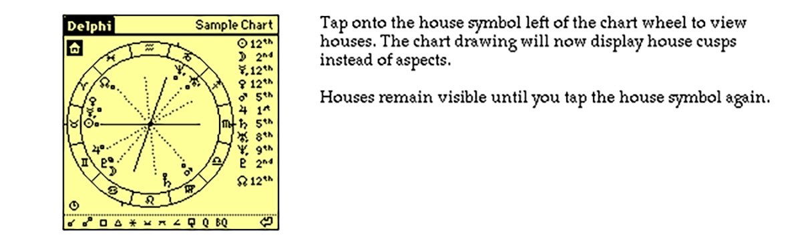
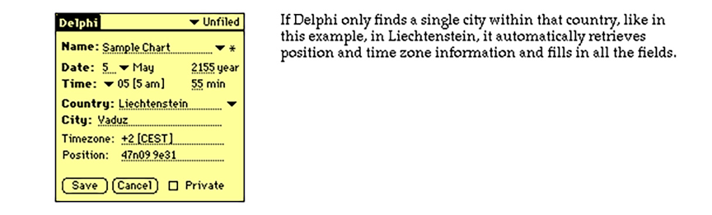
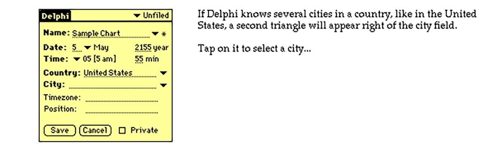
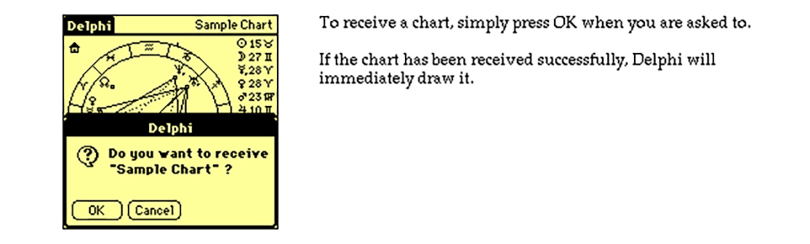
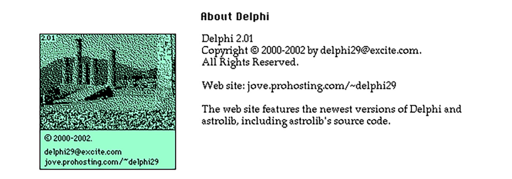

The user manual webpage for Delphi 2.01 in 2002
(images blown up by a factor two, no working links on the images).

Most likely I designed this webpage in HyperCard
and then used some of my HyperCard trueTools stacks
to render the images and image maps for links.

Note that screenshots except the first one
were from the original release of Delphi,
which was not in color, yet.

