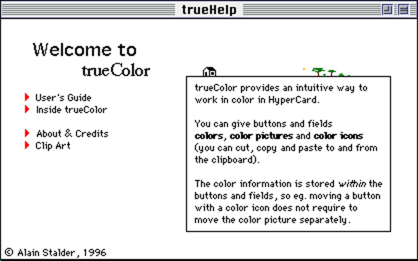
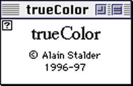
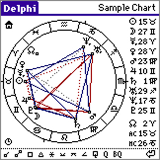

# Vintage Software by me

Public Open Source / Freeware software I –
Alain Stalder (*1966 in Switzerland) –
wrote and published in the past
and which is no longer maintained,
nor usually the systems it ran on.
Vintage…

## trueColor/trueTools for HyperCard (1996-97)

HyperCard was a great tool, it originally came for free with every Mac.
But it was only black and white and there never was a real color version.

**trueColor** made an external command (XCMD) called "ColorizeHC"
much more intuitive to use,
with keyboard and mouse.

I am particularly fond of the associated help documentation
in the included **trueHelp** stack,
where you could also try the features live,
here its title page:

The trueColor stack itself was visually quite small,
just showed credits for my part and used XCMDs:

After writing and publishing trueColor,
I also wrote a collection of further HyperCard tools
called simply **trueHelp**.

This was all Freeware
and by and large Open Source
since scripts, images, icons, etc. in HyperCard
were readable by all.
The only thing that had not been released as source
was a speedup I later implemented by using a compiled XCMD
to implement the core functionality faster than by script,
and unfortunately its source code (C, CodeWarrior compiler) is lost.

You can still run trueColor and trueTools today (at least in 2024)
by running HyperCard in a Mac emulator like Mini vMac.

Some things you can find here in the [HyperCard directory](HyperCard):

* [**ZIP file**](HyperCard/collections/trueColor-trueTools-collection-2018.zip)
  of a collection from 2018 original distributions and some extracted info.
* trueColor 1.03 original distribution: [trueColor-103.hqx](HyperCard/distro/trueColor-103.hqx)
* trueHelp 1.03 original distribution: [trueTools-103.hqx](HyperCard/distro/trueTools-103.hqx)
* All cards of:
  * The [**trueColor**](HyperCard/cards/trueColor.md) stack
  * The [**trueHelp**](HyperCard/cards/trueHelp.md) stack (don't miss!)
  * All [**trueTools**](HyperCard/cards/trueTools.md) stacks
* [**READMEs**](HyperCard/READMEs) of all components, rendered to PDFs
* [**Hypertalk scripts**](HyperCard/HyperTalk) of:
  * The [**trueColor**](HyperCard/HyperTalk/trueColor.md) stack (core color functionality)
  * The [**vue**](HyperCard/HyperTalk/trueTools-vue.md) stack from trueTools
    (an interactive image viewer, to me personally
    one of the most beautiful small pieces of software I ever wrote)
  * [**All**](HyperCard/HyperTalk) stacks

Some general info around HyperCard and especially color:

* [**How HyperCard got its Color Back**](https://orangejuiceliberationfront.com/how-hypercard-got-its-color-back/) (uliwitness 2016)

By the way, I wrote these things during the 1.5 years
I spent as a postdoc in physics at McGill University in Montréal, Canada,
a place I personally never felt even remotely at home.

## Delphi/astrolib for PalmOS (2000-2002)

Shortly after springbreak 2000,
I started to write a small astrology program
(what you would today call an app)
called **Delphi** for PalmOS handheld devices,
and made the first release in October 2000.

Delphi was Freeware but not Open Source
and unfortunately its C source code is lost.

But what has been preserved is the C source code
of the Open Source (LGPL) library called **astrolib**
which I wrote and was used by Delphi.
It calculates astronomical positions of
sun, moon, planets up to Pluto
(Pluto was considered a planet back then),
plus the true lunar nodes,
and it calculates time zones based on
UNIX tz data for all 350 tz locations
plus about 2000 additional locations.

I did not use any code from the UNIX tz data,
but wrote that myself to fit into the small frame of PalmOS,
also compressing the tz data into a condensed binary format.
Also regarding astronomical calculations,
I had to put function parameters into a static array
because the stack was too small on these devices.
Also, optimizing performance in Delphi when drawing charts
was quite a challenge these times;
I wrote my own routines for circles and dotted lines, etc.,
and I created my own font for the various symbols.

Overall, of course, to fit a birth chart onto such a small screen,
which was only 160 x 160 pixels back then, was quite a challenge,
and I am proud of the result.

You can still run Delphi today (at least in 2024)
by running PalmOS in an emulator like, for example,
PHEM on Android devices.

Some things you can find here in the [PalmOS directory](PalmOS):

* [**ZIP file**](PalmOS/collections/Delphi-astrolib-collection-2018.zip)
  of a collection from 2018 that
  contains the original website of 2002 with all distributions
  and also the astrolib source as far as it has been preserved.
* Extracted from the website of 2002:
  * [**Title**](PalmOS/web/index.md) page with blown up images (without links)
  * [**Delphi User's Manual**](PalmOS/web/delphi.md) page with blown up images (without links)
  * [**astrolib**](PalmOS/web/astrolib.md) page rendered to Markdown
  * Page about the [**accuracy**](PalmOS/web/accuracy.md) of Delphi resp. astrolib
* [**Source code of astrolib**](PalmOS/source/astrolib)
  (In C, but using macros to make it read similar to Modula-2,
  which made a difference before syntax coloring in editors)

By the way, Delphi was quite successful,
there were thousands of downloads and quite a few support requests.
While maybe my main reason for writing it had ironically been
to put hashes and signatures of some documents I had written
(around themes that are now at exactphilosophy.net)
into the About screens of different versions of Delphi.
